# LAB-01. IBM Cloud Functions. Ознакомление с IBM Cloud Dashboard

<!-- TOC BEGIN -->
- 1 [Вступление](#p1)

- 2 [Ознакомление с IBM Clound Dashboard](#p2)

- 3 [Создание простой функции из шаблона](#p3)

- 4 [Создание собственной функции](#p4)

- 5 [Выставить функцию, как REST API](#p5)
<!-- TOC END -->

<a name="p1"></a>
## Вступление

В данной лабораторной работе ознакомимся с IBM Cloud Dashboard по созданию IBM Cloud Functions.

<a name="p2"></a>
## IBM Cloud Functions  на IBM Cloud Dashboard

Если зайти в IBM Cloud Dashboard, то IBM Cloud Functions  становятся сразу доступными. На pic-1  показано, где можно найти их.

<kbd>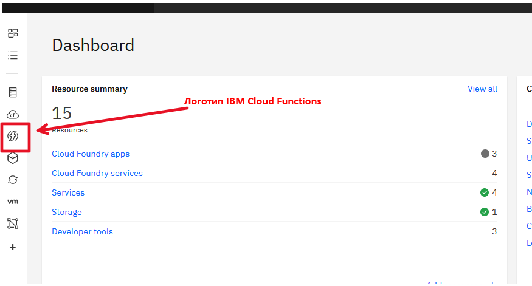</kbd>
<p style="text-align: center;">pic-1</p>                        

В результате нажатия на пиктограмму переходим в главную консоль IBM Cloud Functions. На pic-2 показаны основные элементы управления, необходимые для создания функций.

<kbd>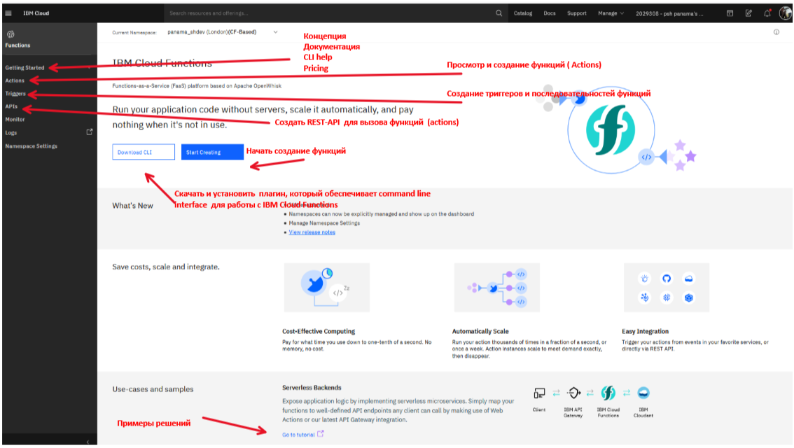</kbd>
<p style="text-align: center;">pic-2</p>


Нажав на кнопку "Start Creating"  попадаем в главный экран по созданию функций (pic-3).

<kbd>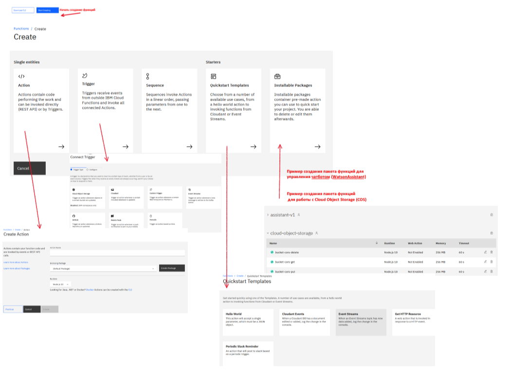</kbd>
<p style="text-align: center;">pic-3</p>

На данном скриншоте показано все многообразие возможностей по созданию функций.

<a name="p3"></a>
## Создание простой функции из уже имеющегося шаблона

Для этого нужно опять войти "Start Creating", выбать "From Template" и выберем "Hello World" (pic-4).

<kbd>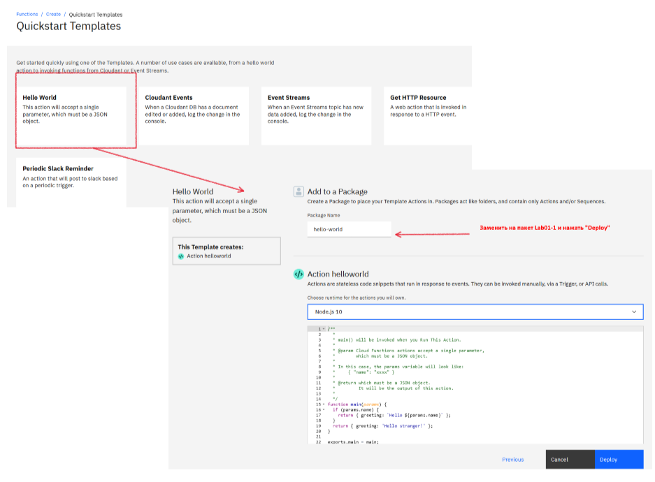</kbd>
<p style="text-align: center;">pic-4</p>

После успешного создания попадем в окно с исходным кодом функции (pic-5).

<kbd>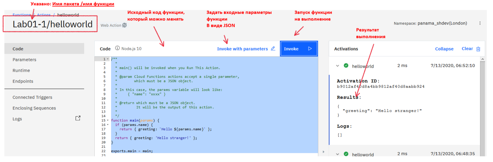</kbd>
<p style="text-align: center;">pic-5</p>

В данном примере, при нажатии на кнопку **"Invoke"**, выполняется запуск функции и результаты работы функции увидим в правой части окна. Параметров в функцию не передавалось, поэтому увидим ответ:

```json
  {
        "greeting": "Hello stranger!"
  }

```
 Теперь по кнопке: **"Invoke with parameters"** зададим параметры запуска функции. Параметры задаются в виде плоского JSON файла. Ниже паказан пример json  параметров.

```json

{   "name": "Jim",
    "phone": "222-33-44",
    "id": 1234567
}
```

Данные этого json нужно вставить в окно ввода параметров и повторить вызов.

<kbd>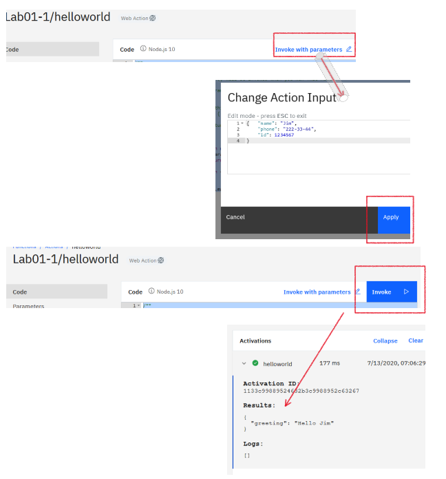</kbd>
<p style="text-align: center;">pic-6</p>

В этом случае ответ уже изменился, и мы получили в ответе **"Hello Jim"**, т.е. параметр **"name"** был прочитан

```json
{
  "greeting": "Hello Jim"
}
```


<a name="p4"></a>
## Создание собственной функции

Перейдем к списку **"Actions"**. Мы увидим только одну функцию helloworld пакете Lab01-1 (pic-7). Для создания своей функции,
<kbd>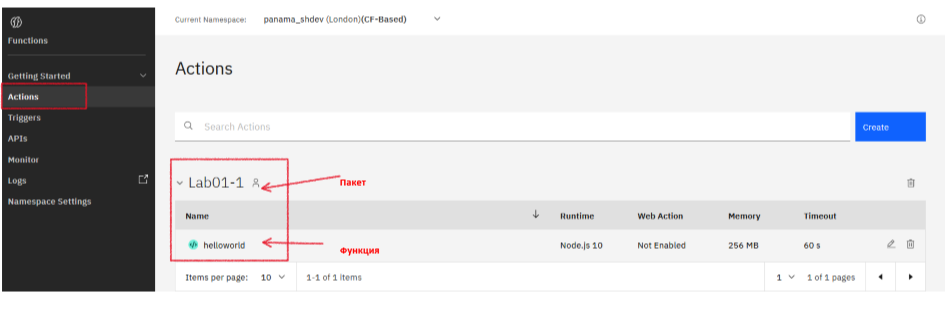</kbd>
<p style="text-align: center;">pic-7</p>

Для создания собственной функции нужно нажать кнопку **"Create"** и выбрать опцию **"Action"**  (pic-8).

<kbd>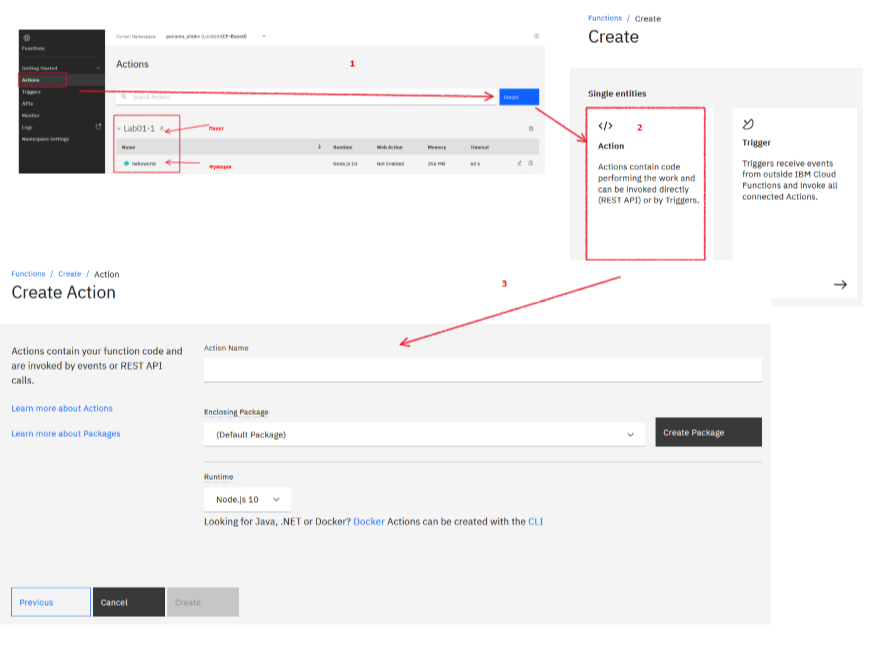</kbd>
<p style="text-align: center;">pic-8</p>

Для создания своей функции нужно:

- внести имя Action, например: **"GetCustomerByPhone"**;

- выбрать имя существующего пакета, или создать новый;

- нажать **"Create"**.

На (pic-9)  показано заполненное окно ввода.
<kbd>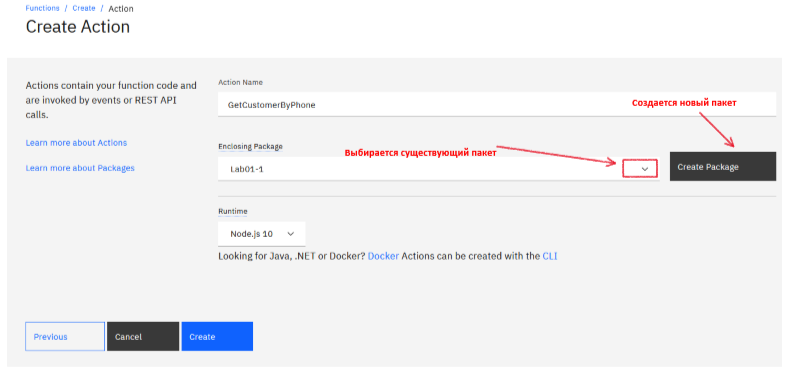</kbd>
<p style="text-align: center;">pic-9</p>

Нажав кнопку **"Create"**, получим шаблон для написания своего исходного кода (pic-10).

<kbd>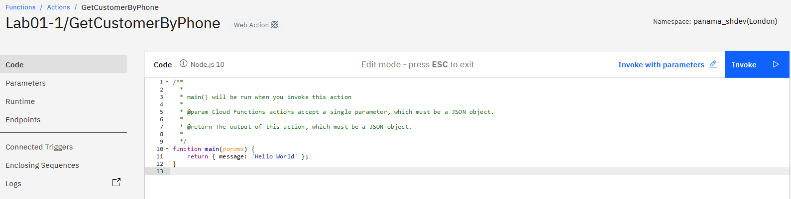</kbd>
<p style="text-align: center;">pic-10</p>

Для написания своей функции (action), придумаем абстрактную задачу. Разработать асинхронную функцию, которая по номеру телефона возвратит данные клиента.

На вход  функция принимает json объект:

```json
    {"phone": "222-33-44"}
```

В случае успешного выполнения, функция возвращает json-обьект:

```json
    {
      "cif": "100012340",
      "cif_address": "Kyiv, Khreschatic, 26, flat 123",
      "cif_firstname": "Pavlo",
      "cif_lasname": "Petrenko"
    }
```

В случае, если телефон не передан, функция генерирует ошибку с сообщением: *"Не передан параметр params.phone!"*

Исходный код функции находится в файле: [/LAB-1/GetCustomerByPhone.js](/LAB-1/GetCustomerByPhone.js)
Исходный код необходимо вставить в окно браузера. В **"Invoke with parameters"**  необходимо вставить json с параметрами запуска
```json
    {"phone": "222-33-44"}
```

 и запустить на выполнение по кнопке **"Invoke"**.
 В результате увидим экран как на pic-11.

<kbd>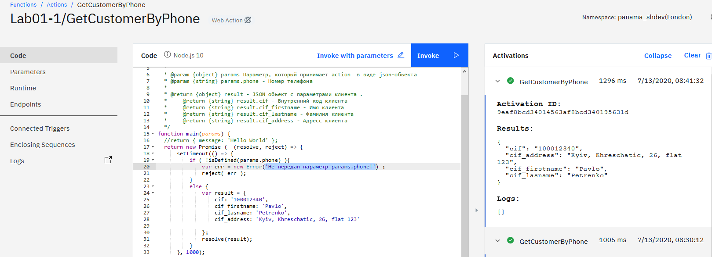</kbd>
<p style="text-align: center;">pic-11</p>

Функция работает. Теперь необходимо ее настроить в качестве REST API  для публичного использования.

<a name="p5"></a>
## Выставить функцию, как REST API

Для этого необходимо
- в разделе Endpoints  включить Web Action (pic-12).

<kbd>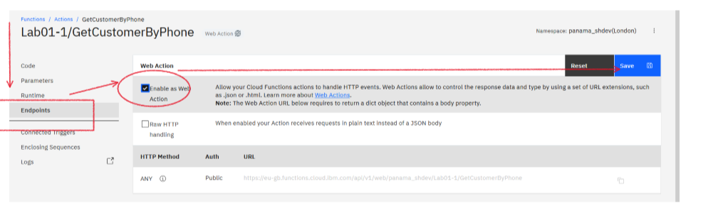</kbd>
<p style="text-align: center;">pic-12</p>

- вернуться в раздел основного меню functions и выбрать раздел API (pic-13).

<kbd>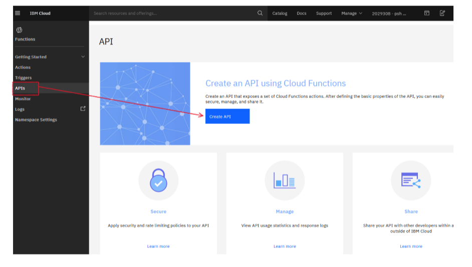</kbd>
<p style="text-align: center;">pic-13</p>

- вводим наименование API и BaseURL.
<kbd>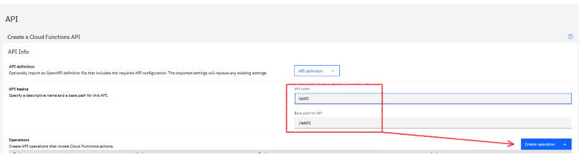</kbd>
<p style="text-align: center;">pic-14</p>

- Устанавливаем http суффикс и http метод.
<kbd>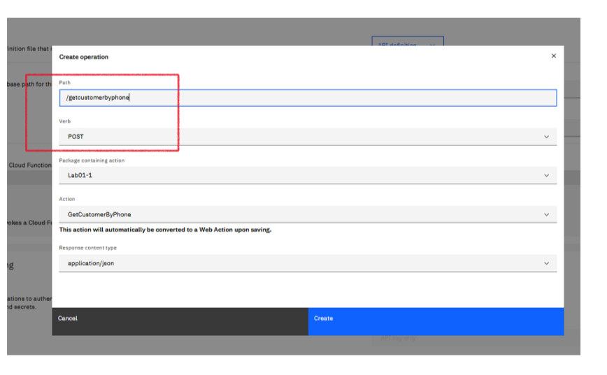</kbd>
<p style="text-align: center;">pic-15</p>

- Авторизацию мы не предусматриваем, поэтому опускаемся вниз и нажимаем **"Create"**

В результате выполнения шагов мы получим экран мониторинга и управления API (pic-16).

<kbd>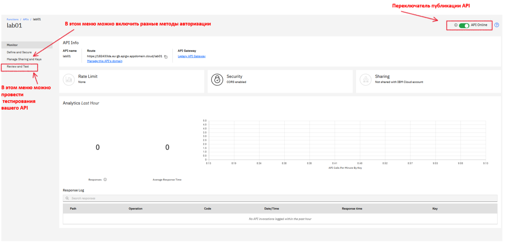</kbd>
<p style="text-align: center;">pic-16</p>

Зайдя в меню **review and test**, выберите вкладку **try it**, введите параметры запроса и запустите на выполнение. Результат показан на pic-17.

<kbd>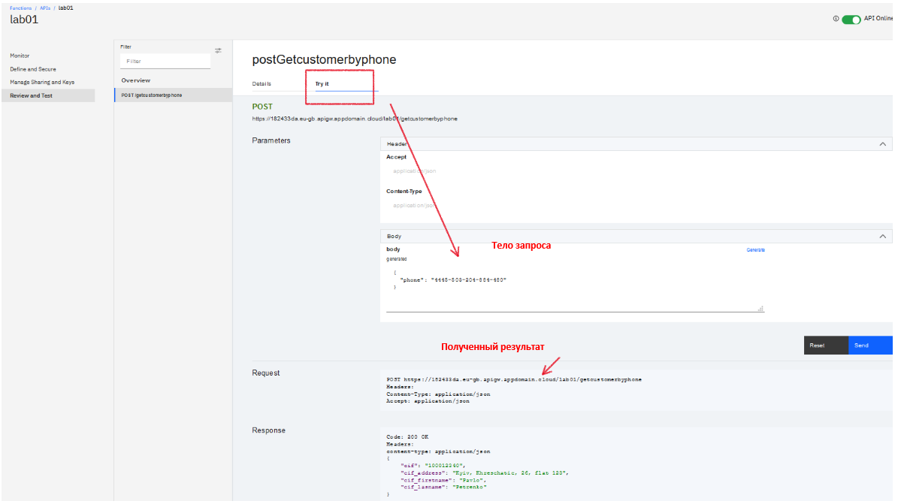</kbd>
<p style="text-align: center;">pic-17</p>
