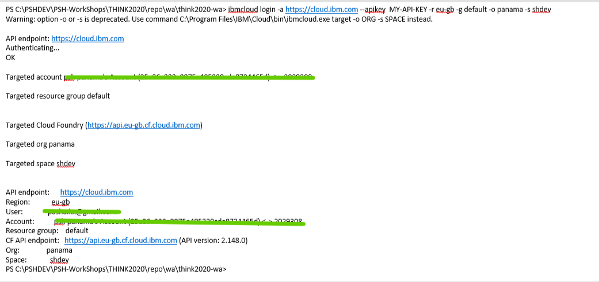

# LAB-02. IBM Cloud Functions. Разработка и deployemnt функций с использованием интерфейса командной строки

<!-- TOC BEGIN -->
- 1 [Вступление](#p1)

- 2 [Ознакомление с IBM CLI](#p2)

- 3 [Разработка функций, которые используют другие http-сервисы](#p3)

- 4 [Создание собственной функции](#p4)

- 5 [Выставить функцию, как REST API](#p5)
<!-- TOC END -->

<a name="p1"></a>
## Вступление

Данная работа предназначена для организации работы разработчиков с применением командной строки CLI.
Для работы будут использованы:
- Visual Studio Code (можно любой другой редактор)
- IBM Cloud CLI
- plugin cloud-function к IBM Cloud CLI

Инструкция по устновке IBM Cloud CLI и plugin cloud-function находится по линку: 
[IBM Cloud fuction setup CLI](https://cloud.ibm.com/functions/learn/cli). 


<a name="p2"></a>
## Ознакомление с IBM Cloud CLI

Первое, что нужно сделать - нужо выполнить логин с помощью CLI в IBM Cloud

Для этого используем команду: **ibmcloud login**

```bash

ibmcloud login -a <API endpoint> -u <user mail> -p <user password> -r <region> -g <resource group> -o <cloudfoundry organisation> -s <space>

```
* -a API endpoint указывается https://cloud.ibm.com
* -u user mail  указывается e-mail  с которым пользователь заходит в IBM Cloud dashboard
* -p user password указывается пароль пользоватлеля, с которым он заходит в IBM Cloud dashboard 
* -r region Указывается регион, в котором будут разворачиваться ваши сервисы
* -g resource group Указывется группа ресурсов. По умолчанию имеет имя default
* -o cloudfoundry organisation 
* -s space in cloudfoundry organisation

Реквизиты: region, resource group, cloudfoundry organisation, space можно получить из аблицы отображения ресурсов (pic-1)
<kbd></kbd>
<p style="text-align: center;">pic-1</p>

Либо, зайдя в свой account в меню: "Manage/Account/Cloud Foundry Orgs" (pic-2)

<kbd></kbd>
<p style="text-align: center;">pic-2</p>


Пример команды:

```bash

 ibmcloud login -a https://cloud.ibm.com -u zzzz@gmail.com -r eu-gb -g default -o panama -s shdev

```
Результат отработки команды показан на pic-3
<kbd></kbd>
<p style="text-align: center;">pic-3</p>

Вводить персональный логин и пароль каждый раз не удобно. Более того, это не самое лучшее решение для выполнения автоматизированых devops  операций. Поэтому, есть возможность зайти в CLI и с его помощью сгенерироаннго [API-KEY](https://cloud.ibm.com/docs/cli?topic=cli-ibmcloud_commands_iam).

```bash
ibmcloud iam api-key-create NAME [-d DESCRIPTION] [--file FILE] [--lock] 
```

* NAME (required)
    Наименование API key, котрый будет создан.
* -d DESCRIPTION (опционально)
    Описание API-KEY.
* --file FILE
    Сохранить информацию об API key ынформцию в заданный файл на локальной станции.
* --lock
    Заблокировать API key когда он будети создан.

Примеры:
Create an API key and save to a file:

```bash
ibmcloud iam api-key-create MyKey -d "this is my API key" --file key_file
```
Файл **key_file** представляет собой JSON.

Таким образом сгеренрируем API-KEY  в локальный файл и будем его исопльзовать в дальнейших операциях. Генерируем, выполнив  команду:

```bash
ibmcloud iam api-key-create devopskey -d "APIKEY FOR DEVOPS" --file psh-devops-key.json 

```

Результат отработки команды показан на pic-4 и в файле **psh-devops-key.json**

<kbd></kbd>
<p style="text-align: center;">pic-4</p>

Теперь модифицируем команду логин для использования в ней API-KEY.
API  выбирается из полученного JSON-файла, поле: **"apikey"**

```bash
 ibmcloud login -a https://cloud.ibm.com --apikey yourApiKey -r eu-gb -g default -o panama -s shdev
```

Результат отработки команды показан на pic-5.

<kbd></kbd>
<p style="text-align: center;">pic-5</p>

Список сгенерированных API-KEYs можно увидеть в своем account, по пути: Manage/Access IAM/API keys.
<kbd></kbd>
<p style="text-align: center;">pic-6</p>


<a name="p3"></a>
## Разработка функций, которые используют другие http-сервисы

В качестве тестового примера разработаем  пакет функций которые образаются к открытым сервисам Национального банка Украины для получения курсов валют.
Так, на странице [API для разработчиков ](https://bank.gov.ua/ua/open-data/api-dev) присутствует описание сервиса для получения курсов валют НБУ:

```text

    Офіційний курс гривні до іноземних валют та банківських металів
    Курс на поточну дату 		
    Курс на дату (формат файлу Статзвітності #99), дата задається у форматі: ddmmyyyy, де dd - день, mm - місяць, yyyy - рік 		
    Курс на дату, дата задається у форматі: yyyymmdd, де yyyy - рік, mm - місяць, dd - день 		
    Курс на дату по валюті (код валюти літерний, регістр значення не має) 		

    Примітка: Поточного дня буде відображатися офіційний курс гривні до іноземних валют, встановлений НА ЗАВТРА за схемою:

        До 16:00 – відображається лише офіційний курс гривні до іноземних валют, що встановлюється 1 раз на місяць.
        Після 16:00 - офіційний курс, зазначений у п.1, та офіційний курс гривні до іноземних валют, що встановлюється щодня.

    Інструкція до сервісу отримання курсів гривні до іноземних валют з першоджерела в момент підписання 	
    Довідкове значення курсу гривні до долара США на 12:00, дата задається у форматі yyyymmdd, де yyyy - рік, mm - місяць, dd - день
```

Необходимо разработать набор функций, которые будут получать курсы НБУ:

- Текущий курс НБУ по всем валютам
- Курс НБУ по всем валютам за указаную дату
- Курс НБУ по указаной валюте за указанную дату
- Функцию конвертации суммы в одной валюте в сумму в другой валюте по курсу НБУ за заданную дату. 
Функции необходимо поместить в один пакет, так как логически они представляют  единый сервис.

Исходный код функций нахъодится в каталоге **./NbuServices**

* getCurrentExchRate.js  - получение текущего курса валют по всем валютам;
* getExchRateByDate.js   - получение курса по всем валютам за заданную дату;
* getExchRateByCCY.js    - получение курса по указанной валюте за указанную дату;
* getConvertCCY.js       - конвертация валют по курсу НБУ.


- 


