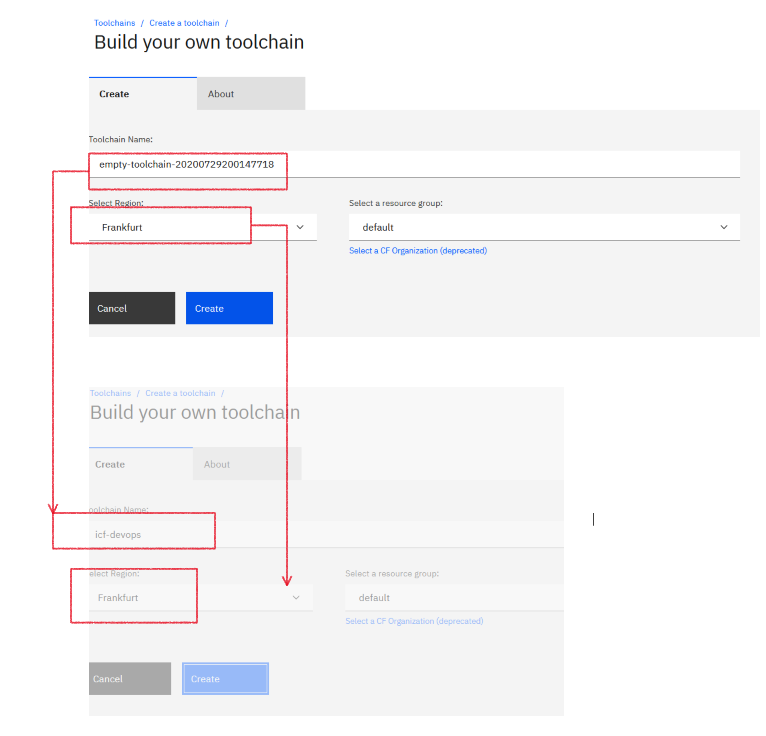
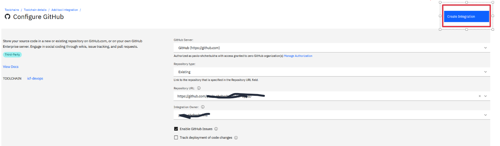

# LAB-03. IBM Cloud Functions. Построение DEVOPS  процесса  разработки, тестировния, deploynebt	

<!-- TOC BEGIN -->

- 1. [Цель работы](#p1)
- 2. [Инструмены, необходимые для выполнения работы](#p2)
- 3. [Краткое описание процесса](#3)
- 4. [Выполннеие работы.](#p4)
- 4.1. [Подготовительные работы](#p5)
- 4.2 [Ознакомиться с каталогами  и файлами пакета  bankapi-customer](#p6)
- 4.3. [Тестирование работаспособности функций локально](#p7)
- 4.4 [Cоздание toolchain в IBM Cloud.](#p8)

<!-- TOC END -->

<a name="p1"></a>
## Цель работы

Интеграция WatsonAssistant  с различными сервсиами проще всего реализовать чере IBM Cloud functions.
<kbd></kbd>
<p style="text-align: center;">pic-0</p>

После написания первых двух функций у меня возникло желание построить DEVOPS процесс разработки и  deployment функций в облако.
Целью этой работы является построение DEVOPS  процесса deployment IBM Cloud Funciton в облако.

В результате выполнения работы будет простроен  DEVOPS  процесс по deployment IBM Cloud functions в IBM Cloud из github репозитория.

<a name="p2"></a>
## Инструменты, необходиромые для выполнения работы

- Нужно иметь откытый Account в [IBM Cloud](https://cloud.ibm.com/l)

- Account  на [github](https://github.com/)


- Установленную Node.js-10  для отладки и запуска приложений локально

- Установленный популярный редактор исходного кода [Visual Studio Code](https://code.visualstudio.com/docs#vscode) с плагинами для Node.js

<a name="p3"></a>
## Краткое описание процесса

Работа с IBM Cloud Functions  выполняется через [сепециальный CLI](https://cloud.ibm.com/functions/learn/cli). Команды CLI  позволяют  выполнить deployment,  запуск функций на выполнение, модификацтю параметров запуска, настройка вызова функций через Web API и еще много  чего.  Но очень хотелось построить процесс так, чтобы разработать и отладить функции локально. Потом сгруппировать функции в пакет. Отправить все содрежимое пакета в GitHub и по commit получить развертывание всех функций пакета в IBM Cloud , как на pic-1.

<kbd></kbd>
<p style="text-align: center;">pic-1</p>

Еще на этапе разработки можно создать конфигурационный YAML - файл, который позволит в нем описать контекст вашего пакета, отправить  все это вместе с исходным кодом в github и потом использовтаь для deoloymet

На этапе разработки процесса приняты такие соглашения:

- Весь проект server less app разбит на каталоги с названиями отображающими названия пакетов.

- в корне каждгого пакета создается package.json  с перечнем пакетов Node.js, которые обспечивают test-driven development и прикладные пакеты, необходимы для работы функций пакета

```json
{
  "name": "bnkapi-customer",
  "version": "1.0.0",
  "description": "ibm-cloud functions sourses",
  "main": "index.js",
  "scripts": {
    "test": "echo \"Error: no test specified\" && exit 1"
  },
  "author": "",
  "license": "ISC",
  "dependencies": {
    "axios": "^0.19.2",
    "chai": "^4.2.0",
    "mocha": "^8.0.1",
    "needle": "^2.5.0",
    "querystring": "^0.2.0",
    "supertest": "^4.0.2"
  }
}

```

- В корне пакет создается  yml-файл с названием пакета, в котором описывется состав пакет:

```yaml
packages:
  bankapi-customer:
    version: 1.0
    license: Apache-2.0
    actions:
      getCustomers:
        function: src/getCustomers.js
        runtime: nodejs
        inputs:
          custname: string
          custid: string
          custtin: integer
          height: float
        outputs:
          greeting: string
          details: string
        web-export: false
      getCustomerbyId:
        function: src/getCustomerByID.js
        runtime: nodejs
        inputs:
          cust_id: number
        web-export: false
      createCustomer:
        function: src/createCustomer.js
        runtime: nodejs
        inputs:
          first_nm: string
          last_nm: string
          email: string
          tin: string
          phone: string
        outputs:
          idcust: integer
        web-export: false
```

Назаначение каталого показано на рисунке pic-2

<kbd></kbd>
<p style="text-align: center;">pic-2</p>


<a name="p4"></a>
## Выполннеие работы.

<a name="p5"></a>
### Подготовительные работы


Выполнить fork github репозиторий в ваш github account. Потом склонировать его на локальную станцию.

 перейти в каталог ./bankapi-customer  и выполнить установку пакетов Node.js  путем выполнения команды 

 ```bash
    npm install
 ```

У вас создаться каталог ./node_modules и создадуться пакеты зависимостей Node.js

<a name="p6"></a>
### Ознакомиться с каталогами  и файлами пакета  bankapi-customer/

В пакете, в каталоге ./src создано 3 функции, по работе с клиентами:

```text
    createCustomer.js - Создать клтента  
    getCustomerByID.js - получить клиента по его id 
    getCustomers.js  - получить список всех клиентов
```        

Эти функции по API вызываю облачный API Gateway.

В корне каталога в  yml-файле выполнено описание (связывание) action  пакета с исходным кодом функций. 

В каталоге ./test  описаны тест кейсы для тестирование и отладки функций локально.

<a name="p7"></a>
### Тестирование работаспособности функций локально

С помощью VCS  запустить в отладчике файл ./test/test-getCustomer.js

В результате выполнения получим: 

```text
Debugger attached.


  Test customer API
bnkapi-customer/getCustomers: Старт
bnkapi-customer/getCustomers: Вызываю сервис: [https://a7275984.eu-gb.apigw.appdomain.cloud/bnkapi-cust/customer]
bnkapi-customer/getCustomers: Сервис вернул успешный статус: [200]
bnkapi-customer/getCustomers: Возвращаю ответ
    √ GetCustomers: Expect customers list  (594ms)
Waiting for the debugger to disconnect...
```

Тоесть локально функция работает. Функию можно протестировать и отладить. Удобно разработчику.

<a name="p8"></a>
## Создание toolchain в IBM Cloud.

- Подключить сервис TollChain из каталога сервисов IBM

<kbd></kbd>
<p style="text-align: center;">pic-3</p>

- Выбрать вариант создания "Your own toolchain"

<kbd></kbd>
<p style="text-align: center;">pic-4</p>

Присвоить toolchain имя и выбрать регион: pic-5 

<kbd></kbd>
<p style="text-align: center;">pic-5</p>

- Создать интеграцию с GitHub

<kbd></kbd>
<p style="text-align: center;">pic-6</p>

Заполнить переметры подключения к github и нажать "create"
<kbd></kbd>
<p style="text-align: center;">pic-7</p>

В результате полчим первую часть toolchain: pic-8.

<kbd></kbd>
<p style="text-align: center;">pic-8</p>

- Подключить интсрумент: DeliveryPipeLine

На pic-9 показаны все шаги по  выполнению подклчения и получению результата.

<kbd></kbd>
<p style="text-align: center;">pic-9</p>

- Сконфигурировать Devlivery PipeLine
Для этого кликнуть на иконке pipeline и потом на кнопке "Add Stage": pic-10

<kbd></kbd>
<p style="text-align: center;">pic-10</p>

- Сконфигурировать deployment-stage

Для этого необходимо переключиться на вкладу jobs и добавть deployment job: pic-11.

<kbd></kbd>
<p style="text-align: center;">pic-11</p>

Сгенерировать api-key  проверить  првильное указание региона и других параметров. В поле sh-скрипта вклеить deplyment скрипт из файла: ./deployment/deploy-job.sh и схоранить.

Результат показан на pic-12
<kbd></kbd>
<p style="text-align: center;">pic-12</p>

В деплоймент script в строке **ibmcloud login** указана environment переменная **--apikey $devops_apikey**,  

```bash
ibmcloud login -a cloud.ibm.com --apikey $devops_apikey -r eu-gb -g default -o panama -s shdev
cd ./bnkapi-customer 
ibmcloud fn deploy --manifest bnkapi-customer.yml
ibmcloud fn package list
ibmcloud fn action list
```
Для внесения env-переменной нужно выполнить операции показзых на pic-13.

<kbd></kbd>
<p style="text-align: center;">pic-13</p>

Запускаем вручную процесс первый раз для проверики pic-14:

<kbd></kbd>
<p style="text-align: center;">pic-14</p>
